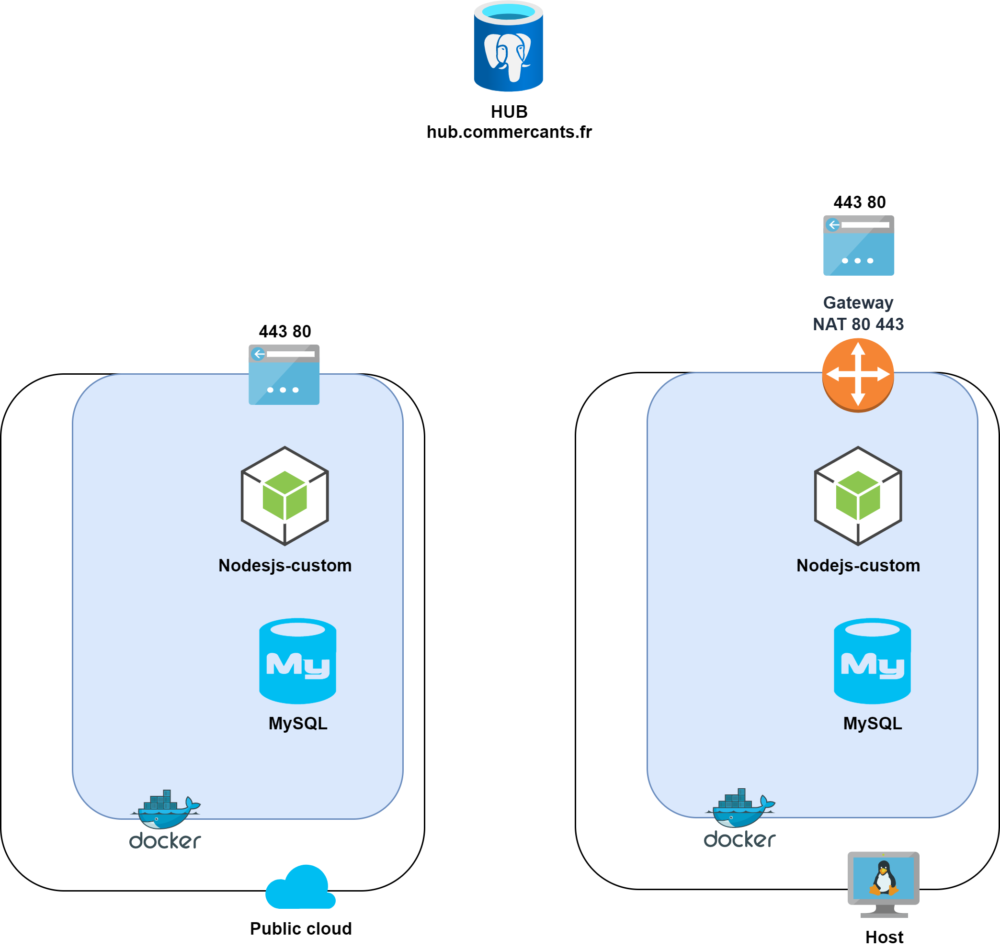

<div id="top"></div>

<!-- CHALLENGE 48H  -->
## Challenge 48H

<!-- Sommaire -->
<details>
  <summary>Sommaire</summary>
  <ol>
    <li>
      <a href="#Presentation projet">Presentation projet</a>
      <ul>
        <li><a href="#problématique">Problématique</a></li>
        <li><a href="#solution">Solution proposée</a></li>
         <li><a href="#réfléxion">Axe de réfléxion</a></li>
      </ul>
      <li><a href="#technolgies">Technolgies utilisées</a></li>
    </li>
    <li>
      <a href="#déploiement">Déploiement</a>
      <ul>
        <li><a href="#prérequis">Prérequis</a></li>
        <li><a href="#installation">Installation</a></li>
      </ul>
    </li>
    <li><a href="#roadmap">Roadmap</a></li>
    <li><a href="#license">License</a></li>
    <li><a href="#contact">Contact</a></li>
  </ol>
</details>


<!-- PRESENTATION PROJET -->
## Presentation projet
<!-- Problématique -->
### Problématique
<br>
Une association nationale de petits commerçants fait appel à vous pour l'aider
à développer une boutique en ligne adaptée aux besoins de ses membres sans
dépendre d'un marketplace ou d'une grosse plateforme de distribution de
manière à proposer à leurs clients partout en France le paiement et la livraison
de leurs produits. <br>
<br>
Ils souhaitent créer un réseau de boutiques fédérées, à la manière des services
décentralisés, tout en conservant leur indépendance de manière à ne pas dépendre d'une plateforme centralisée, de son modèle économique et de sa politique de gestion des données personnelles.<br>
<br>
<!-- solution -->

### Solution
<br>


Afin de développer une boutique en ligne adaptée aux besoins des clients et commercants et creer un réseau décentralisé nous avons determiné que nous avions besoin  : <br>
<br>
D'un Hub avec une base de donnée qui contient la liste de toute les instances <br>
De multiples instances capable de communiquer entre elles ainsi qu'avec le hub   <br>
<br>
Chacune des instances utilise un fichier Docker avec plusieurs contenaires (NodeJS , Vue et MySQL) qui nous permet de faire tourner notre front-end(Vue app) et notre back-end(Node API, MySQL)<br>
En plus de cela l'utilisation de Terraform nous permet de faire la création de notre infrastructure réseau tandis que Ansible vas assurer le déploiement ainsi que l'automatisation de celle-ci  



<br>

### Réflexion 

<p align="right">(<a href="#top">back to top</a>)</p>


### Technolgies
* [](https://www.terraform.io/)
* [](https://www.docker.com/)
* [](https://www.mysql.com/fr/)
* [](https://nodejs.org/en/)
* [ ](https://vuejs.org/)
* [](https://html.spec.whatwg.org/multipage/)
* [](https://www.w3.org/Style/CSS/Overview.en.html)
* [](https://tailwindcss.com/)
* [Ansible](https://www.ansible.com/)

<p align="right">(<a href="#top">back to top</a>)</p>


<!-- Déploiement -->
## Déploiement

### Prérequis

Vous devez au préalable avoir : <br>
[Terraform](https://www.terraform.io/) <br>
[Ansible](https://www.ansible.com/) <br>
[NodeJS](https://nodejs.org/en/) <br>
[Docker](https://www.docker.com/) <br>

<br>

### Installation
1. Cloner le repo :
```
 https://github.com/NuRoZ123/challenge48Hgeneral.git
```
2. Créer ces 2 fichiers : <br>
`.secret`:
```bash
# Azure
ARM_CLIENT_ID=
ARM_CLIENT_SECRET=
ARM_SUBSCRIPTION_ID=
ARM_TENANT_ID=
# OVH
OVH_ENDPOINT=ovh-eu
OVH_APPLICATION_KEY=
OVH_APPLICATION_SECRET=
OVH_CONSUMER_KEY=
```
`.env`:
```bash
# Main
INSTANCE1_URL=
INSTANCE1_IP=
# Docker
POSTGRES_PASSWORD=iamthepassword
```
3. Créer et deployer l'infrastructure en utilisant Terraform dans le dossier ./terraform
```bash
terraform init
```
```bash
terraform apply
```
4. Vous allez obtenir l'IP publique de l'instance , copier/coller dans le fichier `hosts` dans le répertoire Ansible <br>
    Ensuite lancer cette commande dans le répertoire ansible
```bash
ansible-playbook host.yml -i ./hosts -v
```
5. 
```

```
6. 
 ```

 ```


<p align="right">(<a href="#top">back to top</a>)</p>


<!-- ROADMAP -->
## Roadmap

- [x]Déploiement Infrastructure réseau
- [x]Docker container NodeJS Vue + MySql
- [x]Affichage du site
- [x]Base de données
- [x]Présentation des produits des instances
- [x]Création de comptes clients et commercants 
- [ ]Paiement fonctionnel
- [ ]Envoi d'emails de confirmation


<p align="right">(<a href="#top">back to top</a>)</p>

<!-- LICENSE -->
## License

Distributed under the MIT License. See [LICENSE.txt]() for more information.

<p align="right">(<a href="#top">back to top</a>)</p>


<!-- CONTACT -->
## Contact 

PELLETIER Thomas - [thomaspelletier44@gmail.com] <br>
LOUIS Simon - [simon.louis638@gmail.com] <br>
GOUZIEN Killian - [killiangouzien44220+ydays@gmail.com] <br>
FAKHFAKH Rayen - [rayen.fakhfakh@ynov.com] <br>
CARDOSO Esteban - [esteban.cardoso@ynov.com] <br>

Project Link: [https://github.com/NuRoZ123/challenge48Hgeneral.git](https://github.com/NuRoZ123/challenge48Hgeneral.git)

<p align="right">(<a href="#top">back to top</a>)</p>