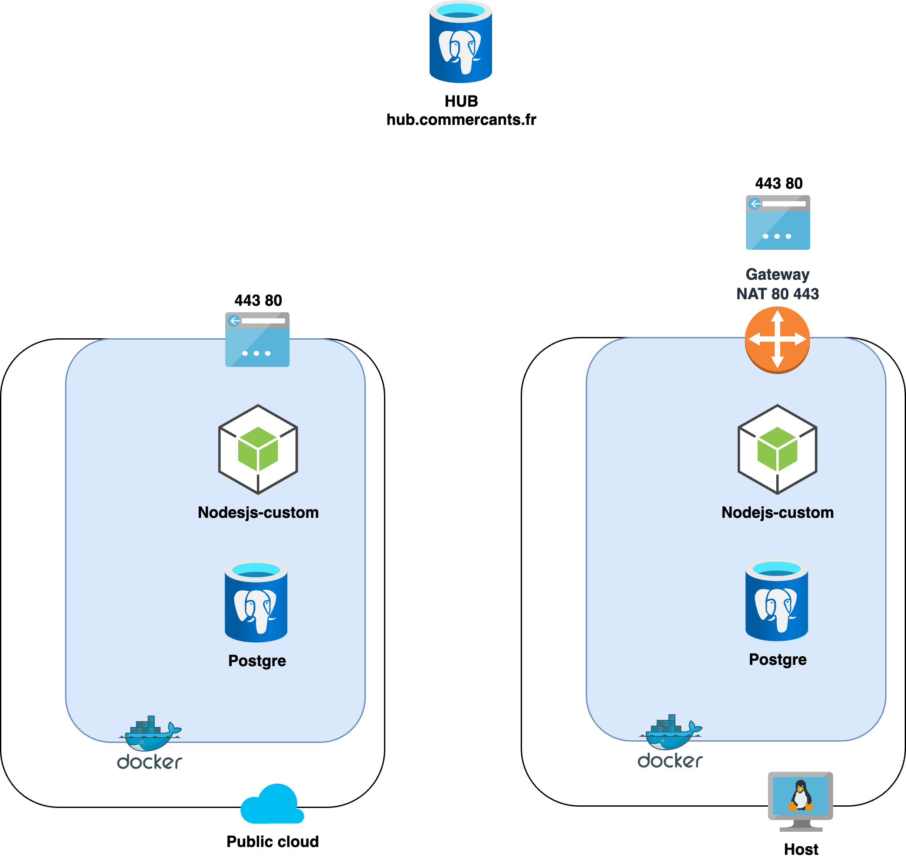

# infrastructure

This project define the infrastructure of this project.

You need to run Terraform and Ansible.

## Scheme



## How to deploy

First, create the two following files

`.secret`:
```bash
# Azure
ARM_CLIENT_ID=
ARM_CLIENT_SECRET=
ARM_SUBSCRIPTION_ID=
ARM_TENANT_ID=
# OVH
OVH_ENDPOINT=ovh-eu
OVH_APPLICATION_KEY=
OVH_APPLICATION_SECRET=
OVH_CONSUMER_KEY=
```
`.env`:
```bash
# Main
INSTANCE1_URL=
INSTANCE1_IP=
# Docker
POSTGRES_PASSWORD=iamthepassword
```

Then, create the infrastructure using Terraform in the ./terraform directory

Deploy the infrastructure:
```bash
terraform init
```
```bash
terraform apply
```

You will get the public IP of an instance as output, copy/paste it in the `hosts`file in the Ansible directory

Then in the Ansible directory, run the following command:

```bash
ansible-playbook host.yml -i ./hosts -v
```